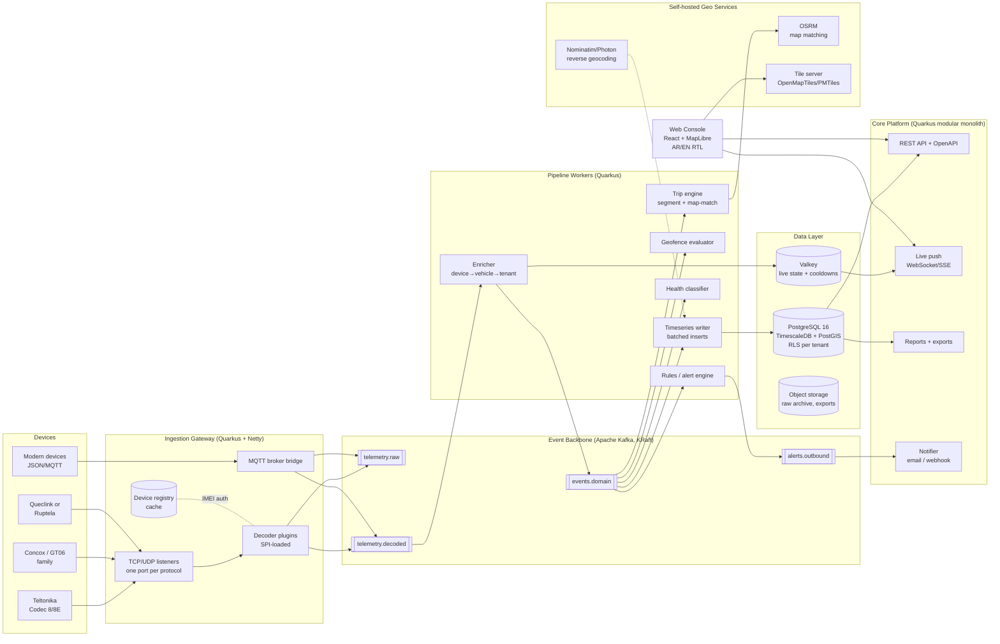

# Solution Architecture — Phase 1
## **EaglesEye** — Fleet Telematics Platform

| Field | Value |
|---|---|
| Document | Solution Architecture — Phase 1 (Core Tracking Platform) |
| Version | 0.1 — Draft for review |
| Date | 04 August 2026 |
| Owner | Moataz — Product & Engineering |
| Status | Draft |
| Related | BRD-Phase1-Fleet-Telematics.md (scope baseline) |

---

## 1. Architectural Principles

Derived directly from the BRD's constraints and architectural obligations:

| # | Principle | Source |
|---|---|---|
| P-1 | **Ingestion is sacred.** The ingest path must survive outages of everything else — console, API, even the stream processors. Acknowledge to a device only after durable persistence. | NFR-03, NFR-04 |
| P-2 | **Decoders are plugins, never business logic.** A decoder's only job: bytes in → normalised telemetry out + protocol-correct ACK. It knows nothing about tenants, vehicles, or trips. | BR-02, AO-04, NFR-13 |
| P-3 | **Everything flows through the event bus.** Every domain event is published whether or not anyone consumes it yet. Phase 2 modules subscribe; they do not require re-architecture. | AO-03, BG-04 |
| P-4 | **Tenant isolation lives in the database.** Row-Level Security enforced in PostgreSQL, not only in application code. | FR-SEC-08, AO-05 |
| P-5 | **Modular monolith over microservices.** A small team ships 3 deployables, not 12 services. Module boundaries are strict *inside* the code so extraction later is possible. | AS-07, CN-03 |
| P-6 | **Permissive open source, self-hostable everywhere.** No component may block deployment to an arbitrary region or impose per-seat fees that break regional pricing. | CN-02, CN-04, NFR-09 |
| P-7 | **Recompute over reconcile.** Late/buffered data doesn't get patched into derived data — the affected window is marked dirty and recomputed from raw positions. Simpler, and always correct. | BR-10, FR-TRP-07 |

---

### Product thesis and non-goals (added 10 Aug 2026)

> **"Don't watch the map — get the verdict."** EaglesEye is not a surveillance dashboard; it is a fleet
> supervisor that reports to the owner: the **Daily Digest** (exceptions only, framed in money, Arabic-first,
> WhatsApp-ready) is the product's heartbeat, and the console is the deep-dive surface for dispatchers.
> Every capability ships behind a per-tenant flag so Phase-2+ modules become sellable units (module
> marketplace). Full reasoning: `docs/business/Competitive-Study-and-Product-Thesis`.
>
> **Explicit non-goals** (we refuse these fights — Wialon/Navixy territory): field-service task dispatch
> and mobile forms; video telematics; routing/dispatch optimisation beyond the BRD's Phase-3 note.
> **Phase-2 module order, fixed by market pull:** 1) fuel, 2) temperature/cold chain, 3) maintenance,
> 4) driver scoring, 5) client-facing apps.

## 2. System Overview



**Three deployables** (plus infrastructure):

1. **Ingestion Gateway** — protocol listeners + decoder plugins. Stateless except for connection state; horizontally scalable behind a TCP load balancer (NFR-05).
2. **Pipeline Workers** — Kafka consumers doing enrichment, trip segmentation, geofence evaluation, rules, health classification, and time-series persistence. One deployable, internally modular; any module can be split out later by moving its consumer group.
3. **Core Platform** — the modular monolith: REST API, auth integration, tenancy, device/vehicle management, reports, live-push, notification delivery. Serves the web console.

---

## 3. Ingestion Design

> **Phase-1 posture (ADR-9, decided 07 Aug 2026):** protocol ingestion runs through a **Traccar bridge** —
> a headless Traccar instance (Apache-2.0, Docker) terminates device connections, decodes all protocols,
> and forwards normalized positions/events into our Kafka topics. Everything downstream (enricher, trips,
> geofences, rules, health, storage) is unchanged and never knows who produced the telemetry.
> The in-house gateway + decoder SPI described in §3.1–3.4 below is **retained as the dormant escape hatch**:
> if we outgrow the bridge (durability guarantees, native health depth, a protocol worth owning), gateways
> replace Traccar per-protocol, incrementally, behind the same Kafka contract. NFR-04's ack-after-persist
> guarantee is relaxed in bridge mode: Traccar acks devices after its own DB write; a **reconciliation job**
> (Traccar API vs our positions) detects and backfills forwarding gaps, and Traccar's DB is purged on a
> short window so our TimescaleDB remains the system of record.

### 3.1 Listeners and framing (dormant escape hatch — see ADR-9)

- One **TCP (and UDP where the protocol requires) port per protocol family**. Devices are configured by installers to `host:port`; the port determines which decoder pipeline handles the connection. No protocol auto-detection in Phase 1 — it is a common source of subtle bugs.
- Built on **Netty** (already underneath Quarkus). Each protocol plugin contributes its own framing handler (length-prefix, delimiter, etc.) and codec to the Netty pipeline.
- **MQTT/JSON** path (FR-ING-04): an embedded/adjacent MQTT broker (Eclipse Mosquitto) bridged into the gateway, with a defined JSON telemetry schema published in the docs.

### 3.2 Decoder plugin contract (the SPI)

```java
public interface ProtocolDecoder {
    String protocolId();                      // "teltonika-codec8", "gt06", ...
    ChannelPipelineContributor framing();     // Netty framing for this protocol
    DecodeResult decode(ByteBuf frame, SessionContext ctx);
    ByteBuf buildAck(DecodeResult result, SessionContext ctx);  // FR-ING-11
}
```

- `DecodeResult` yields zero or more normalised `TelemetryRecord`s: device time, GPS (lat/lon/alt/speed/heading/satellites/fix), ignition, inputs, voltages, event codes, plus a raw key/value bag for protocol-specific IO elements.
- Plugins are **separate Maven modules** loaded via `ServiceLoader`. They depend on a small `decoder-api` artifact only — no dependency on core services (P-2). Adding a decoder = new module + config entry; core is untouched (acceptance criterion #10).
- **Session context** carries the authenticated IMEI. Authentication (FR-ING-05): first protocol login frame → IMEI checked against the device registry (local cache, refreshed from Kafka compacted topic / DB). Unregistered IMEIs are logged to a `telemetry.rejected` topic and the connection dropped politely (FR-ING-06) — never crashing the listener.

### 3.3 Durability and acknowledgement (NFR-04)

The critical sequence, per frame:

1. Raw frame → produce to `telemetry.raw` (key = IMEI) **and** decoded records → `telemetry.decoded`, both with `acks=all`.
2. Only after Kafka confirms, the protocol ACK is written back to the device socket.
3. Device clears its buffer (FR-ING-11). If we crash before ACK, the device re-sends — safe, because processing is idempotent (§3.4).

Kafka is therefore the durability point, not PostgreSQL. The DB can be down for an hour; ingestion keeps accepting and devices keep clearing buffers (P-1, NFR-03).

`telemetry.raw` retention = the raw-payload debugging window (FR-ING-09), e.g. 30 days, then archived to object storage. This topic doubles as the **decoder regression replay harness** input (RK-06).

### 3.4 Idempotency, ordering, backlog (BR-10, FR-ING-07/08/10)

- **Dedup key**: `(device_id, device_timestamp, seq)` — enforced by `ON CONFLICT DO NOTHING` on the positions hypertable and idempotent consumers. Re-delivered frames are harmless.
- **Out-of-order/buffered records** are inserted at their *device* timestamp, not arrival time. Each insert that lands outside the "live edge" (> N minutes old) marks the `(vehicle, day)` dirty for recompute (P-7).
- **Reconnect storms** (RK-03): gateway does no heavy work — decode and produce only. Backpressure = Kafka. Load test M1 with simulated 10× backlog bursts before pilot.

---

## 4. Event Backbone

**Apache Kafka in KRaft mode** (no ZooKeeper), 3 brokers in production, single broker in dev.

| Topic | Key | Content | Retention |
|---|---|---|---|
| `traccar.positions` | — | Bridge output: Traccar position envelopes (ADR-9) | 7 days |
| `traccar.events` | — | Bridge output: Traccar events (motion, online/offline…) | 7 days |
| `telemetry.raw` | IMEI | Raw frames + metadata *(dormant — own-gateway mode only)* | 30 days → archive |
| `telemetry.decoded` | IMEI | Normalised TelemetryRecords | 7 days |
| `telemetry.rejected` | IMEI | Unregistered/undecodable traffic | 7 days |
| `events.domain` | vehicle_id | Enriched positions, ignition, geofence enter/exit, trip closed, device connect/disconnect, decode errors — *everything* (AO-03) | 30 days |
| `alerts.outbound` | tenant_id | Materialised alerts pending delivery | 7 days |
| `registry.devices` | IMEI | Compacted — device registry snapshot for gateway cache | compacted |

Keying by IMEI/vehicle guarantees per-device ordering where it matters. Consumer groups per pipeline module allow independent scaling and replay.

*Why Kafka over NATS JetStream:* replay + retention + compacted topics are load-bearing here (recompute, decoder regression, registry cache), Kafka is Apache-2.0 (CN-02), and its operational burden in KRaft mode is acceptable. Redpanda was excluded on licence (BSL). Decision recorded in §12/ADR-2.

---

## 5. Data Layer

### 5.1 One database, three extensions

**PostgreSQL 16 + TimescaleDB (positions/events time-series) + PostGIS (geofences, spatial queries)** — a single operational database for Phase 1.

- **Positions** — Timescale hypertable, partitioned by time, `segment_by = device_id` compression after 7 days. 2,000 msg/s inserted in batches by the timeseries writer is comfortable; benchmark evidence gathered in M1 load test (NFR-01).
- **30-day single-vehicle query < 3 s** (NFR-07): index `(device_id, device_time DESC)`; compressed chunks segment-by device make this a near-sequential read.
- **Retention** (NFR-06): 12 months in hypertables (compressed ≈ 10× smaller), then `drop_chunks` after export to Parquet on object storage.
- **Geofences**: PostGIS `geometry` columns + GiST index; point-in-polygon checks in the geofence evaluator use a cached, per-tenant in-memory prepared-geometry set, invalidated via `events.domain` on geofence change.
- **Trips/stops/alerts/audit**: ordinary relational tables.

*Why not ClickHouse:* a second database is a second thing to operate, back up, and secure (AS-07). Timescale at pilot scale is nowhere near its limits; ClickHouse remains the documented escape hatch if Phase 2 analytics demand it (ADR-3).

### 5.2 Tenant isolation (P-4, FR-SEC-01/08)

- Every tenant-scoped table carries `tenant_id NOT NULL`.
- **PostgreSQL Row-Level Security** on all tenant-scoped tables; the application sets `SET LOCAL app.tenant_id = ...` per transaction from the authenticated principal. The app role has no `BYPASSRLS`.
- Tenant hierarchy (AO-01, FR-SEC-02): `tenant.parent_tenant_id` self-reference; RLS policies grant a parent read access to child tenants — modelled now, exercised by the reseller portal in Phase 3.
- Tenant record carries branding fields — logo, colours, custom domain — nullable and unused in Phase 1 UI (AO-02).

### 5.3 Live state — Valkey

**Valkey** (BSD-licensed Redis fork, CN-02) holds:

- Last-known state per vehicle (position, status, ignition, address) — the live map reads this, not the DB.
- Alert cooldown windows (FR-ALT-06) — `SET ... NX EX <cooldown>`.
- WebSocket fan-out pub/sub between Core Platform instances.

Valkey is a cache: losing it degrades the live map for seconds until the enricher repopulates it. Nothing durable lives there.

---

## 6. Pipeline Workers

All are Kafka consumers in one deployable; each module = one consumer group.

| Module | Consumes | Produces | Notes |
|---|---|---|---|
| **Enricher** | `telemetry.decoded` | `events.domain`, Valkey live state | Resolves IMEI → device → vehicle → tenant (assignment history honoured, FR-DEV-02); derives status (moving/idle/stopped/offline/no-fix, FR-TRK-03); requests reverse geocode (cached, FR-TRK-05) |
| **Trip engine** | `events.domain` | trip/stop rows, `trip.closed` events | Segmentation by ignition + movement hysteresis (FR-TRP-01); per-tenant thresholds (FR-TRP-08); on trip close, path is **map-matched via OSRM `/match`** and distance computed from the matched geometry (FR-TRP-02, SM-02/RK-01). Dirty vehicle-days from late data → nightly + on-demand recompute (FR-TRP-07) |
| **Geofence evaluator** | `events.domain` | enter/exit/dwell events | In-memory prepared geometries per tenant; hysteresis (two consecutive fixes) to prevent boundary flapping; time-window rules (FR-GEO-06) |
| **Rules engine** | `events.domain` | `alerts.outbound` | Declarative rule definitions per tenant/vehicle-group (FR-ALT-01/02); cooldown dedup via Valkey **mandatory** (FR-ALT-06, RK-05); no code deploy to add a rule instance |
| **Health classifier** | `events.domain`, connection events | health status rows, internal alerts | Decision tree over last-fix vs last-connect vs power/voltage events → `no_network / no_gps_fix / power_disconnected / device_silent` (FR-HLT-03, acceptance #6); connection history log (FR-HLT-05) |
| **Timeseries writer** | `telemetry.decoded` | positions hypertable | Micro-batched `COPY`/multi-row inserts, `ON CONFLICT DO NOTHING` (dedup) |

**Alert/webhook delivery** (Core Platform notifier): transactional **outbox** table → delivery workers. Email (SMTP/Jakarta Mail) and webhooks with exponential backoff + dead-letter status visible to the tenant (FR-API-03, FR-ALT-03/04). WhatsApp/SMS (FR-ALT-05, OQ-06) behind a `NotificationChannel` interface — pluggable later without touching the rules engine.

---

## 7. Core Platform

- **Quarkus modular monolith**: modules for tenancy, identity, devices/vehicles, geofence CRUD, alerts, reports, API tokens, notifier. Hibernate ORM + Flyway migrations.
- **AuthN/AuthZ**: **Keycloak** (Apache 2.0) as OIDC provider — password policy, sessions, 2FA/TOTP (FR-SEC-05/06) come free. One realm; tenant membership + roles (Platform Admin, Tenant Admin, Manager, Viewer, Installer) as claims; vehicle-group visibility (FR-SEC-04) enforced in the app layer on top of RLS tenant scoping. Audit log table for all admin mutations (FR-SEC-07).
- **Public API** (FR-API): the same REST resources the console uses, under `/api/v1`, documented via SmallRye OpenAPI (FR-API-04). PAT-style API tokens: hashed at rest, tenant-scoped, revocable (FR-API-02). Per-tenant rate limiting with **Bucket4j** (FR-API-05).
- **Live push**: WebSocket (SSE fallback) channel per user session; server filters by tenant + visible groups; positions fan out from Valkey pub/sub (FR-TRK-02, NFR-02).
- **Reports** (FR-RPT): SQL over trips/positions/events; Excel via Apache POI; **PDF via a renderer with proven Arabic shaping/RTL support (FR-LOC-04) — validate OpenPDF/libharu-class options in a spike during M2; this is a known trap** (see RK-A6). Scheduled email delivery via Quartz (FR-RPT-08).
- **Runtime configuration service**: operational parameters are data, not code — stored in a `platform_settings` table, exposed via admin REST API, editable from the console UI (admin screens). First settings: data retention months (OQ-07), Timescale compression window, default alert cooldown, trip idle threshold (FR-TRP-08). Each setting has an **applier**: a component that reacts to changes (e.g. the retention applier re-issues `add_retention_policy` on the positions hypertable when retention months change — lands with T-207). Tenant-scoped overrides (`tenant_settings`) follow once tenancy exists (T-401); platform scope ships first. Settings endpoints are Platform-Admin-only once OIDC is wired (T-403).

---

## 8. Geo Services (self-hosted, AS-06)

| Service | Component | Licence | Role |
|---|---|---|---|
| Map matching | **OSRM** (`/match`) | BSD-2 | Snap trip paths to roads; matched distance is the reported distance (SM-02) |
| Reverse geocoding | **Photon** (primary) / Nominatim | Apache-2.0 / GPLv2 (server-side use OK) | Coordinates → address, cached aggressively in Valkey (geohash-keyed) |
| Tiles | **OpenMapTiles/Planetiler → PMTiles** static tiles | BSD/ODbL data | Regional extract (Egypt/Gulf) served as static files — near-zero serving cost (CN-04) |
| Frontend map | **MapLibre GL JS** | BSD-3 | Console map, clustering, drawing tools for geofences |

OSM data for Egypt + Gulf is a small extract; all three services run on one modest VM at pilot scale. OSRM graph rebuilds are monthly and offline.

---

## 9. Frontend

- **React + TypeScript + Vite**, MapLibre GL for the map, TanStack Query for data, **i18next** for AR/EN with full RTL (logical CSS properties + `dir` switching, FR-LOC-01/02). All timestamps rendered in tenant timezone (FR-LOC-03). Metric units only (FR-LOC-05).
- Design the UI Arabic-first and verify English second — the reverse ordering is how RTL bugs ship (acceptance #8).

---

## 10. Deployment, Operations, Observability

- **Everything is containerised.** Pilot reference deployment: Docker Compose (or k3s if preferred) on 2–3 VMs in the customer-required region — any provider with a regional presence works, keeping NFR-09 a configuration question, not an architecture question. Provisioning scripted with Ansible; promotion path to managed Kubernetes stays open.
- **Environments**: dev (single-node everything), staging (with device simulator + raw-traffic replay), production.
- **Observability** (NFR-10): OpenTelemetry from Quarkus (free with the framework) → **Prometheus + Grafana + Loki**. First-class dashboards: ingestion rate, decode error rate per protocol, Kafka consumer lag (paged on), device-to-map latency (SM-03 measured continuously, not just in tests), DB insert latency.
- **Backup/restore** (NFR-11): nightly `pgBackRest` base backup + WAL archiving to object storage → RPO ≤ 15 min; restore rehearsal is an M5 exit criterion (acceptance #9). Kafka topics are recoverable buffers, not systems of record — except `telemetry.raw` within its window, which is also mirrored to object storage.
- **Secrets** (NFR-08): environment-injected from a vault/SOPS-encrypted store; never in git.

---

## 11. NFR Traceability

| NFR | Design answer |
|---|---|
| NFR-01 throughput | Stateless gateway + Kafka + batched hypertable inserts; M1 load test at 2k sustained / 5k burst is the exit evidence |
| NFR-02 latency ≤ 5 s p95 | Decode → Kafka → enricher → Valkey → WebSocket; no DB read on hot path; latency measured end-to-end in Grafana |
| NFR-03 ingestion availability | Gateway depends only on Kafka + registry cache; DB/API/console can be down without ingest loss |
| NFR-04 durability | ACK to device only after `acks=all` Kafka write (§3.3) |
| NFR-05 horizontal scale | Gateway is stateless per connection; add instances behind TCP LB; devices never reconfigured |
| NFR-06 retention | Timescale compression + `drop_chunks` at 12 months after Parquet archive |
| NFR-07 query perf | `(device_id, time)` indexing + segment-by-device compression |
| NFR-08 security | TLS everywhere terminated at LB/gateway; disk encryption; Keycloak; RLS |
| NFR-09 residency | Fully self-hosted stack, region = deployment variable |
| NFR-10 observability | OTel + Prometheus/Grafana/Loki; consumer-lag alerting |
| NFR-11 recovery | pgBackRest, WAL archiving, rehearsed restore |
| NFR-13 maintainability | Decoder SPI + separate Maven modules; acceptance #10 tests it with a real developer |

---

## 12. Decision Log (ADR summary)

| # | Decision | Chosen | Rejected | Why |
|---|---|---|---|---|
| ADR-1 | Deployment shape | Modular monolith + gateway + pipeline (3 deployables) | Microservices | Team size (AS-07); strict module boundaries keep later extraction cheap |
| ADR-2 | Event backbone | Apache Kafka (KRaft) | NATS JetStream, Redpanda, RabbitMQ | Replay/retention/compaction are load-bearing (P-3, P-7); Redpanda licence (BSL) fails CN-02; Rabbit lacks replay |
| ADR-3 | Telemetry store | TimescaleDB on PostgreSQL | ClickHouse, InfluxDB, plain Postgres partitions | One database to operate; PostGIS synergy; pilot scale well within capacity; ClickHouse documented as Phase 2+ escape hatch |
| ADR-4 | Tenant isolation | Postgres RLS + `tenant_id` | Schema-per-tenant, DB-per-tenant | FR-SEC-08 satisfied at DB layer without operational explosion at 10s–100s of tenants; DB-per-tenant reserved for future single-tenant enterprise deals |
| ADR-5 | Identity | Keycloak | Build-your-own, commercial IDPs | 2FA/session/password policy for free; Apache-2.0; self-hostable in-region |
| ADR-6 | Geo stack | OSRM + Photon + OpenMapTiles + MapLibre | Google/Mapbox APIs, Valhalla | Per-call pricing breaks CN-04 and residency; Valhalla viable alternative if OSRM matching quality disappoints in the M3 odometer validation |
| ADR-7 | Live cache | Valkey | Redis (post-licence-change), DB polling | BSD licence; pub/sub + TTL cooldowns; cache-only role keeps it non-critical |
| ADR-8 | Decoder sourcing | Write decoders in-house against the SPI, using Traccar (Apache-2.0) source as a *reference* for protocol quirks | Embedding/forking Traccar | Keeps decoder-api clean and plugin contract honest; Traccar's protocol knowledge is a map of firmware landmines (RK-06) — use it as documentation, respect the licence with attribution (DP-06) |
| ADR-9 | **Phase-1 ingestion (supersedes ADR-8 for Phase 1)** | **Traccar as protocol bridge**: headless Docker instance decodes all protocols, forwards positions/events to our Kafka; device registry synced core→Traccar via REST; reconciliation job covers forwarding gaps; short purge window keeps Timescale the system of record | Own decoders first (ADR-8) | Solo-founder build-vs-buy: 15 years of battle-tested decoders and device commands for free; decoders are commodity — differentiation lives above them. Decoder SPI stays dormant as escape hatch; swap per-protocol later behind the same Kafka contract. Founder ran Traccar in production (Alvora) — operational knowledge is leverage |

---

## 13. Risk Register — Architecture View

BRD risks RK-01…09 remain owned in the BRD. This register adds architecture-specific risks and binds mitigations to design elements above.

| ID | Risk | Impact | Likelihood | Mitigation (bound to design) | Trigger / early warning |
|---|---|---|---|---|---|
| RK-A1 | **Kafka operational burden** exceeds a small team's capacity (upgrades, rebalancing, disk pressure) | Medium | Medium | KRaft mode (no ZK); 3-node fixed-size cluster; consumer-lag + disk alerts in Grafana from day one; runbooks written in M1 | On-call time spent on Kafka > 2h/week |
| RK-A2 | **RLS performance or bypass bugs** — a missed policy or a `SECURITY DEFINER` hole breaks FR-SEC-01 | High | Low | RLS enabled by default on every new table via migration lint; automated cross-tenant leak test in CI (two tenants, assert zero visibility); app DB role has no BYPASSRLS | Any query plan showing seq-scan across tenants; CI leak test red |
| RK-A3 | **OSRM map-matching quality on regional roads** (unmapped areas, new roads in Gulf cities) breaks the 2% odometer target | High | Medium | M3 validation on a real vehicle for 30 days *is the gate* (RK-01); fallback chain: fresher OSM extracts → Valhalla trial (ADR-6) → hybrid raw-GPS distance where match confidence is low, flagged per trip | Match confidence < 0.8 on > 10% of pilot trips |
| RK-A4 | **Timescale ingest/query degradation** as compression jobs, recomputes, and reports contend | Medium | Low | Batched writes; recompute + reports run against a streaming replica if contention appears; M1 load test includes concurrent query load, not ingest alone | p95 insert latency > 500 ms; NFR-07 query > 3 s in staging |
| RK-A5 | **Device registry cache staleness** in gateway — newly registered device rejected, installer stuck on site (FR-DEV-08 broken) | Medium | Medium | Registry via compacted Kafka topic consumed continuously (< 1 s propagation); on cache miss, gateway does a direct registry lookup before rejecting | Installer support calls about "device not accepted" |
| RK-A6 | **Arabic PDF rendering** (shaping, ligatures, RTL tables) fails late in M4/M5 | Medium | High | Spike the PDF pipeline in **M2**, not M5; acceptance test = native speaker reviews a real exported report early; libraries with proven Arabic shaping only | Any report showing disconnected Arabic glyphs |
| RK-A7 | **Recompute storms**: a fleet returning from a coverage dead-zone dirties hundreds of vehicle-days at once | Medium | Medium | Recompute queue is rate-limited and prioritised (live-edge first, history second); recompute is idempotent so it can be paused/resumed | Recompute queue depth alert |
| RK-A8 | **WebSocket fan-out at scale** — many concurrent operators × many vehicles saturates Core Platform | Low | Low | Per-session server-side filtering to visible groups only; positions throttled to 1 update/vehicle/second on the wire; SSE fallback | Push latency drifting toward the 5 s budget |
| RK-A9 | **Geo data licence obligations** (OSM/ODbL attribution, Nominatim usage policy if not self-hosted) missed | Medium | Low | Self-host everything (no usage policies apply); attribution strings baked into map UI; component licence register kept in this doc §8 and reviewed per DP-06 | Legal review findings |
| RK-A10 | **Modular monolith erosion** — module boundaries blur under pilot deadline pressure, making Phase 2 extraction expensive (CN-03) | Medium | High | Maven enforcer / ArchUnit rules on module dependencies in CI; decoder-api and module APIs versioned; boundary violations fail the build, not code review | ArchUnit failures being suppressed instead of fixed |
| RK-A11 | **Single-region pilot infrastructure** — one provider/VM failure takes the whole platform down within 99.5% budget | Medium | Medium | Ingestion nodes spread across ≥ 2 hosts; Kafka replication factor 3; documented cold-standby restore in second region within RTO 4 h (NFR-11); full HA deferred deliberately, accepted as pilot posture | Any single-host incident consuming > 50% of monthly error budget |
| RK-A12 | **Traccar bridge dependency (ADR-9)** — forwarding gaps lose telemetry silently; upstream breaking changes; health signals (decode errors, raw frames) less structured than owning the gateway | Medium | Medium | Reconciliation job with gap alerting (positions in Traccar DB but absent from Kafka/Timescale); Traccar version pinned, upgrades tested in staging; raw hex logging enabled in Traccar config; decoder SPI kept dormant as per-protocol exit path | Reconciliation backfills > 0.1% of daily positions; any upgrade breaking forwarding schema |

---

## 14. Open Architecture Decisions

Deliberately unresolved; each has a default so nothing blocks.

| # | Question | Default until decided | Decide by |
|---|---|---|---|
| OA-1 | Cloud/hosting provider per region (ties to OQ-05 market choice) | Any Docker-capable VMs in-region; provisioning is Ansible either way | Before M2 |
| OA-2 | Docker Compose vs k3s for pilot production | Compose (lowest ops), k3s if team prefers | Before M5 |
| OA-3 | MQTT broker: Mosquitto vs EMQX community | Mosquitto (simpler, sufficient at pilot scale) | Before M1 |
| OA-4 | PDF engine with Arabic shaping | Spike in M2 (RK-A6) decides | End of M2 |
| OA-5 | Third protocol: Queclink vs Ruptela (FR-ING-03) | Driven by pilot device inventory (OQ-02) | Before M1 |

---

## 15. Revision History

| Version | Date | Author | Change |
|---|---|---|---|
| 0.1 | 04 Aug 2026 | Moataz + Claude | Initial draft |
